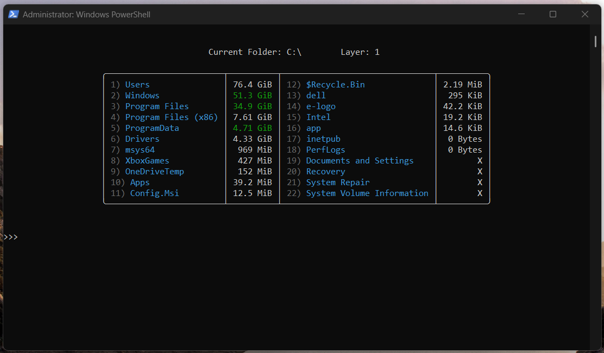

# stman

Windows' built-in storage tools don't tell you much. Explorer makes you right-click every folder individually. I wanted something that would actually show me where my disk space was going.

stman is a CLI tool that scans your drives and directories and displays sizes in a sorted table. Navigate into any folder to see what's inside it.



## Installation

```
pip install stman
```

Requires Python 3.8+ on Windows 10/11.

## Usage

```
stman
```

### Commands

| Command | Description |
|---|---|
| `goto` | Jump to a specific path |
| `b` | Go back one directory |
| `top` | Go to drive root |
| `r` | Refresh current view |
| `togglex` | Show/hide inaccessible folders |
| `clearcache` | Clear cached sizes |
| `help` | List all commands |
| `exit` | Quit |

### Benchmark Mode

```
stman --benchmark <path>
```

Runs stman's scanner against PowerShell's `Get-ChildItem` on the same directory (with disk cache pre-warmed for both) and reports the comparison.

## Benchmarks

```
Benchmarking: C:\Program Files
──────────────────────────────────────────────────
  stman (C++ DLL):     0.63s
  PowerShell GCI:      14.28s
  Speedup:             22.5x
──────────────────────────────────────────────────

Benchmarking: C:\Users\glcon
──────────────────────────────────────────────────
  stman (C++ DLL):     2.06s
  PowerShell GCI:      13.54s
  Speedup:             6.6x
──────────────────────────────────────────────────
```

Speedup varies with directory width — wider trees give the thread pool more parallel work to distribute. `C:\Program Files` has many independent top-level subdirectories; `C:\Users` is deeper and narrower.

## How it works

The scanner is a C++ DLL called via Python's `ctypes` FFI. It uses Win32's `FindFirstFileExW` with `FIND_FIRST_EX_LARGE_FETCH` for fast directory enumeration, and distributes subdirectories across a thread pool sized to `hardware_concurrency()`. The Python layer handles the CLI, caching, and display.

## License

MIT